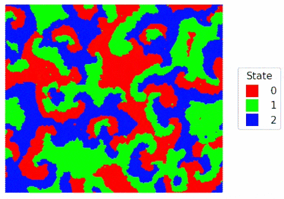
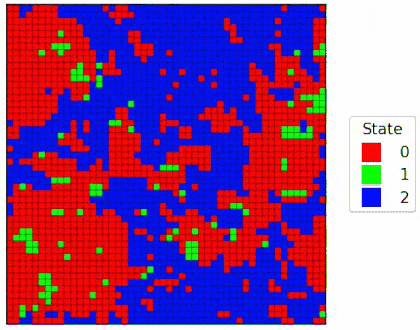
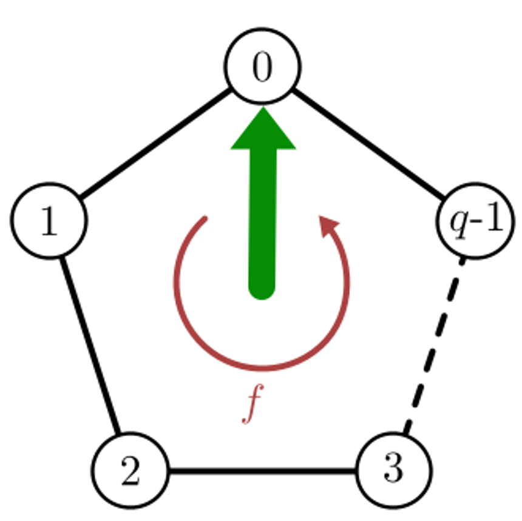
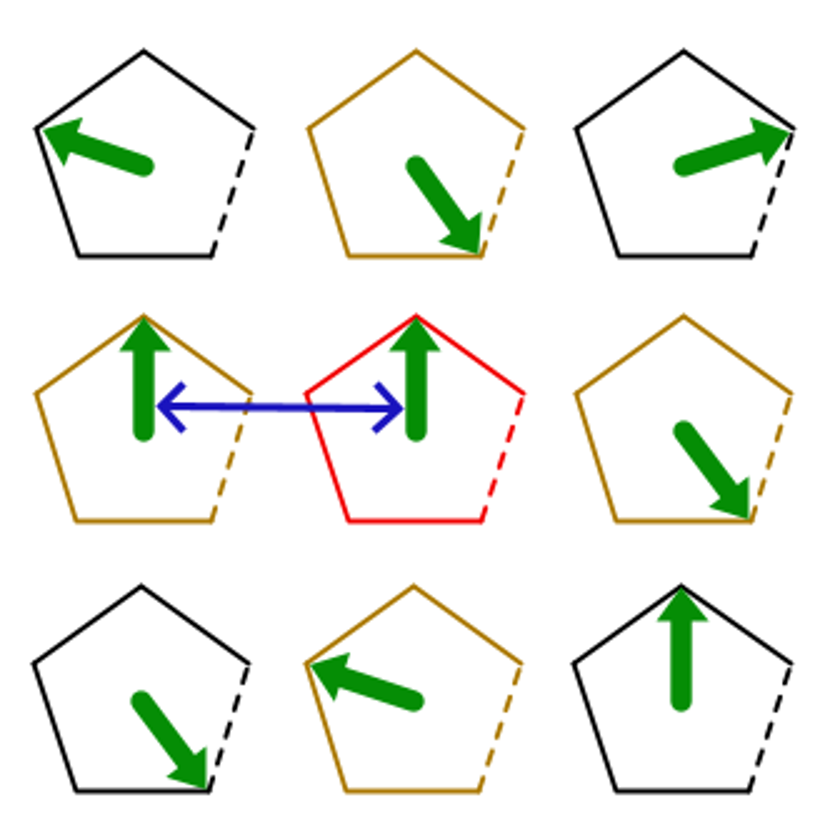

# simulateDrivenPottsModel

This repository contains Julia code used to simulate a driven Potts model for investigating phase transitions and critical behaviour. The codebase includes multiple simulation approaches, each implemented in its own folder. For the exact nearest-neighbour Gillespie algorithm we developed a novel implementation for which one time step does not scale with system size. 

<table align="center">
<tr>
<td align="center">
<br>
<b>BKT like Phase on a two-dimensional hexagonal lattice (Simulation: NN_Gillespie_Exact).</b>
</td>
<td align="center">
<br>
<b>Synchronized Phase on a three-dimensional cubic lattice (Simulation: NN_Gillespie_Exact).</b>
</td>
</tr>
</table>

## Model
This project simulates **driven Potts models** using several exact and approximate simulation methods. Each lattice site is a Potts oscillator that occupies one of `q` cyclically arranged states and stochastically jumps between neighboring states. A non-conservative driving force biases these transitions, driving the system out of equilibrium.

Oscillators interact ferromagnetically: every pair occupying the same state lowers the system's energy. Two interaction topologies are implemented:

- **Mean-field:** every oscillator interacts equally with all other oscillators in the system.
- **Nearest-neighbor:** each oscillator interacts only with its adjacent lattice neighbors.

The dynamics are modeled as a continuous-time Markov process satisfying local detailed balance.

| Single oscillator | Nearest-neighbor interactions |
|:-----------------:|:-----------------------------:|
|  |  |
|  A Potts oscillator with `q` cyclically arranged states. The driving force biases transitions in one direction. |  Nearest Neighbor interactions: The highlighted oscillator interacts only with neighboring oscillators occupying the same state. |

## Simulations

- `MF_RungeKutta_Infinite/` — Runge–Kutta solution for the thermodynamic limit (infinite system).
- `MF_Gillespie_Finite/` — Exact Gillespie simulation for finite mean-field interactions.
- `NN_Gillespie_Exact/` — Exact nearest-neighbour Gillespie simulation.
- `NN_MonteCarlo_Approx/` — Approximate nearest-neighbour Monte Carlo simulation (time-discretized).

# Requirements
- Julia v1.10.10 or higher
  - Package: StatsBase v0.34.6 or higher
  - Package: Distributions v0.25.122 or higher
  - Package: JSON v1.1.0 or higher
  - Package: JLD2 v0.5.15 or higher

## Quick start
Move to the folder of a simulation (e.g. use `cd NN_Gillespie_Exact`) and configure the simulation with the config file and run `julia execute_simulation.jl`

Example:
```bash
cd NN_Gillespie_Exact
julia execute_simulation.jl
```

## Configuration
Configuration files are JSON and live inside each simulation folder (e.g., `NN_Gillespie_Exact/config.json`). The configuration options are outlined in the simulation-specific README (for example, `cd NN_Gillespie_Exact` and open `README.md`).

## Algorithm sketch for the Nearest-neighbour Model
Here we outline our novel implementation of the Gillespie algorithm that provides much better scaling for this particular system.

The vanilla Gillespie algorithm considers all possible single-particle transitions at every step. For a system of n Potts oscillators, this means checking 2n rates: one up and one down transition per oscillator. This implementation avoids that scaling by combining the microscopic state with a coarse-grained transition description.

The key observation is that, in the nearest-neighbor Potts model, the transition rate of an oscillator does not depend on the full lattice configuration. It only depends on its effective neighborhood: the difference between the number of neighbors in the target state and the number of neighbors in the current state. Since the number of nearest neighbors M is finite, the effective neighborhood can only take 2M + 1 values. Therefore, all oscillators with the same effective neighborhood have the same transition rate and can be grouped together. This reduces the number of Gillespie transition classes from 2n to 2(2M + 1), independent of system size.

The coarse-grained description is only used to sample transition classes efficiently. The full microscopic lattice state is still stored and updated, so the algorithm generates exact stochastic Gillespie trajectories without time discretization.

Initialize:
    s[i]          current state of oscillator i
    LNN[i]        nearest-neighbor list of oscillator i

    d_plus[i]     effective neighborhood for up transition of i
    d_minus[i]    effective neighborhood for down transition of i

    D_plus[j]     number of oscillators with d_plus = j
    D_minus[j]    number of oscillators with d_minus = j

    K_plus[j]     up transition rate for effective neighborhood j
    K_minus[j]    down transition rate for effective neighborhood j

    Ld_plus[j]    list of oscillators with d_plus = j
    Ld_minus[j]   list of oscillators with d_minus = j

    pos_plus[i]   position of oscillator i in Ld_plus
    pos_minus[i]  position of oscillator i in Ld_minus
    
while simulation is running:

    # 1. Compute total escape rate
    R_plus  = sum_j D_plus[j]  * K_plus[j]
    R_minus = sum_j D_minus[j] * K_minus[j]
    R_total = R_plus + R_minus

    # 2. Draw Gillespie holding time
    Δt ~ Exponential(R_total)
    t  = t + Δt

    # 3. Choose transition direction
    choose UP with probability R_plus / R_total
    otherwise choose DOWN

    # 4. Choose effective-neighborhood class
    if UP:
        choose j with probability D_plus[j] * K_plus[j] / R_plus
        choose oscillator m uniformly from Ld_plus[j]
        s[m] = s[m] + 1 mod q
    else:
        choose j with probability D_minus[j] * K_minus[j] / R_minus
        choose oscillator m uniformly from Ld_minus[j]
        s[m] = s[m] - 1 mod q

    # 5. Update local data structures
    for oscillator m and its nearest neighbors:
        recompute affected d_plus and d_minus values
        move affected oscillators between Ld_plus / Ld_minus classes
        update D_plus, D_minus, pos_plus, pos_minus

This gives exact continuous-time stochastic trajectories like Gillespie, but each step depends only on the finite number of neighborhood classes and the local update region, rather than on the total number of particles.


